# 领地系统操作指南

## 温馨提示：本系统依托[sdf1_login登录插件](sdf1_login.md) 如果您: 
- [ √ ] 服务器持有人: 注意是否安装sdf1_login插件 
- [ √ ] 服务器玩家: 确认protect是否可以执行 
- [ √ ] 插件下载: 见github、gitee、gitcode、git.ypshidifu.cn、bbsmc

| 操作方式 | 是否支持 |
| :---: | :---: |
| dos纯指令 | √ |
| CLI交互式操作 | √ |
| GUI交互式操作 | √ |
| php交互式操作 | √ |

## 一、 CLI模式-主菜单介绍
CLI是基于命令行的一种交互模式，相比较GUI，它更直观
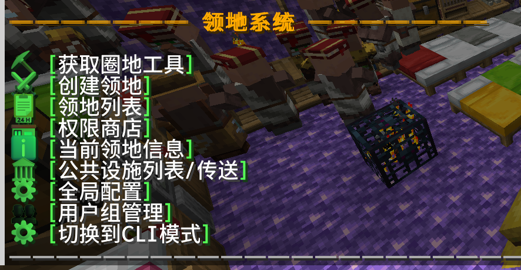
- 圈地工具: 使用专属烈焰棒，不冲突不会因为该物品不是MC原版物品，该物品具备独立NBT，和原版物品互不干扰 
- 创建领地: 以自身为中心，创建一个9㎡的领地 
- 领地列表: 普通用户展示属于自己的或自己可管理的领地，管理员则展示全服所有的领地。 
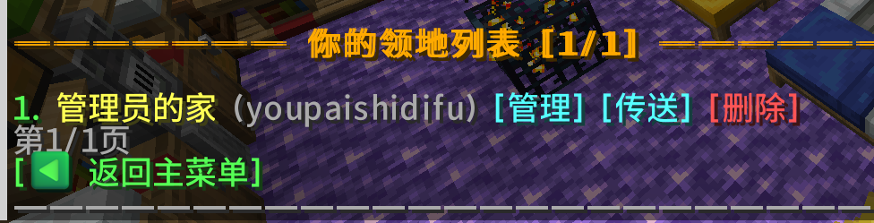 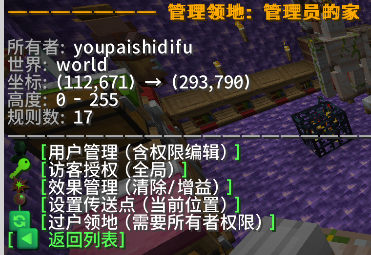 
- 当前领地信息: 打印当前所属领地的联系人信息 
- 公共设置列表/传送: 公共建筑(如小黑塔、刷帖机)等对公开放的建筑，可设置为公共建筑，一键传送到位 
- 全局配置: 管理员可通过该配置，配置默认用户拥有多少格领地，创建领地价格是多少 
- 用户组: 相当于VIP，管理员可以授予玩家VIP身份，然后基于不同的权限。比如VIP可以创建100个领地，1块钱1㎡，普通玩家只能创建5个，3块钱1㎡ 
- 切换CLI模式: 在GUI/CLI模式下切换 

## 权限级别表格

| 玩家身份 | 权限限制 |
| :---: | :---: |
| 普通用户 | 受全局权限影响 |
| OP | 同普通用户 |
| 插件管理员(tag) | 不受权限影响 |
| 普通授权用户 | 受授权范围影响 |
| 普通授权管理员 | 当前领地最高权限，但不能过户 |
| 领地主 | 当前领地最高权限 |

## 二、 CLI模式-领地权限列表介绍
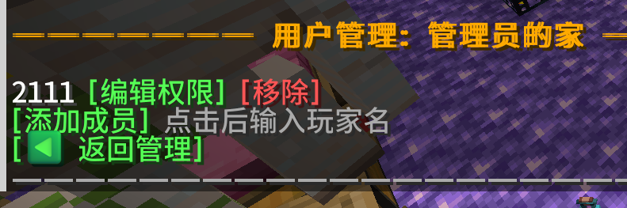
- 编辑权限: 配置玩家独立权限 
- 移除: 把玩家移除领地，玩家权限受全局影响 
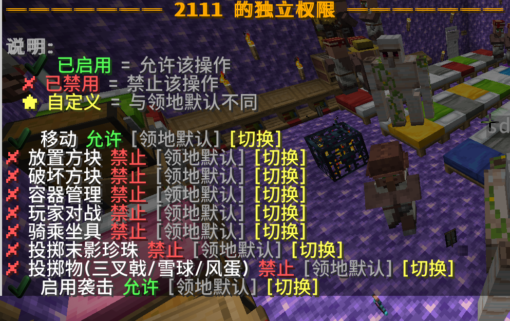 
- ×: 禁止操作, √: 允许操作 
- 设为管理员: 当前领地管理员，获得领地最高级权限 
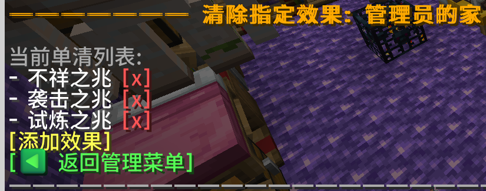 
- 单清效果: 清理某一个效果 
- 全清效果: 清除全部负面效果 
- 给予效果: 给予玩家某个效果 
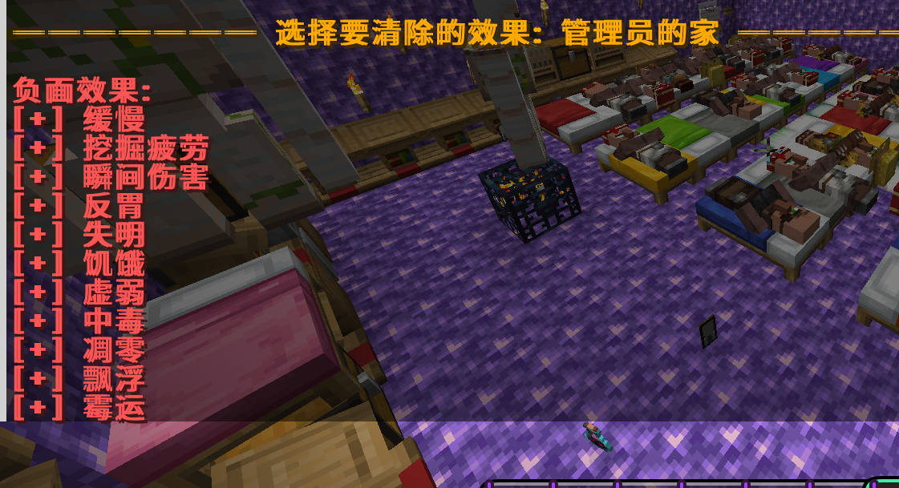 

## 三、 GUI模式-主菜单介绍
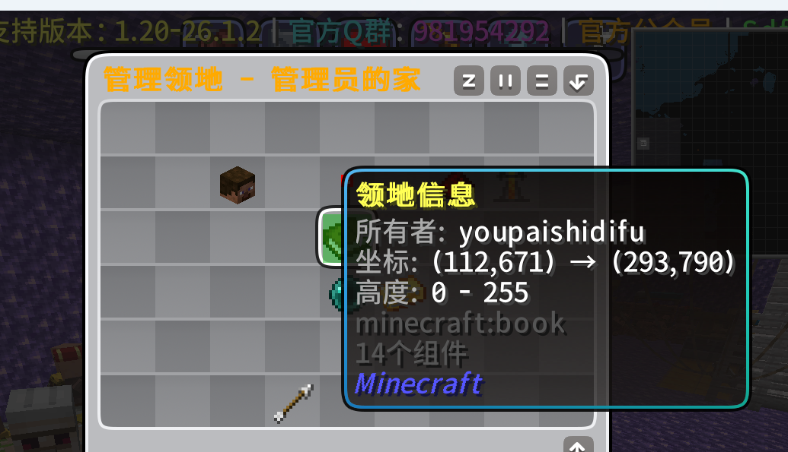 
- 领地信息: 展示当前领地联系人信息 
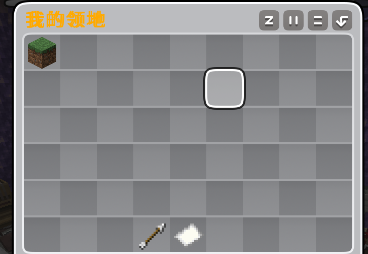 
- 我的领地: 展示玩家作为领地主的领地和管理员展示所有玩家领地信息的地方 
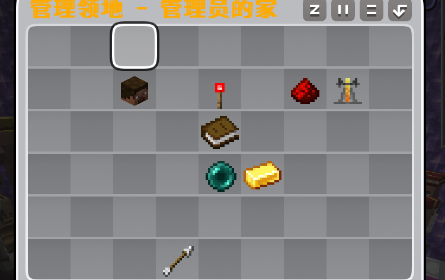 
- 领地面板: 配置领地的逐项权限 
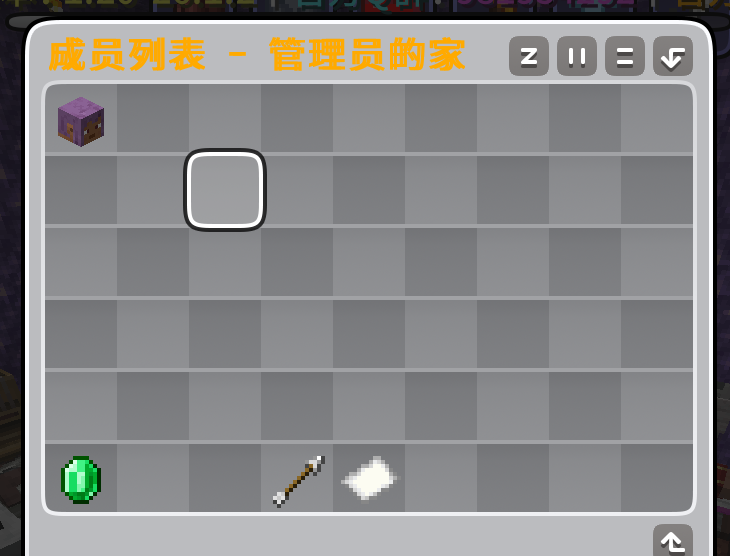 
- 成员管理: 添加授权成员 
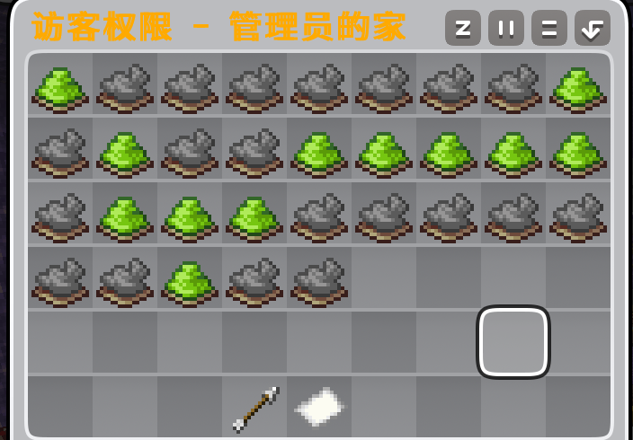 
- 访客权限: 管理所有未授权访客的全局权限 
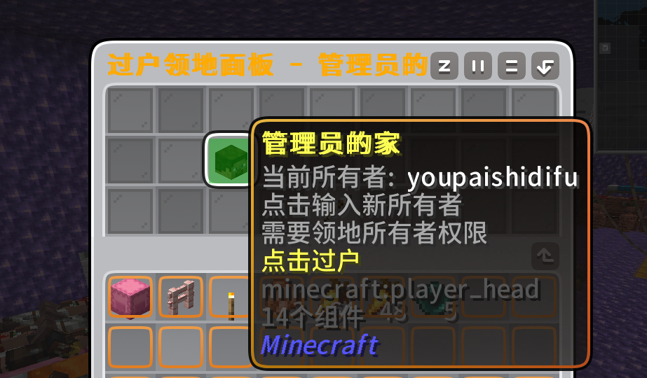 
- 过户面板: 将领地过户给它人 
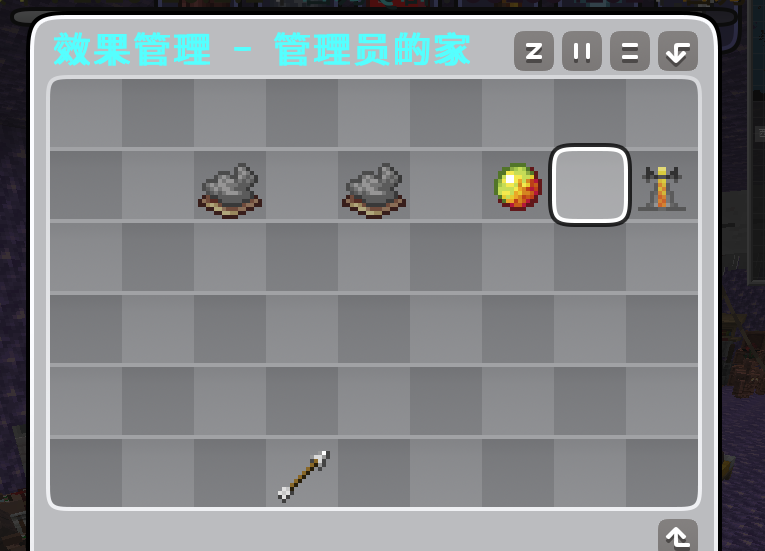 
- 效果面板: 移除/新增领地的相关效果 
- 管理面板: 调整领地的各项设置 
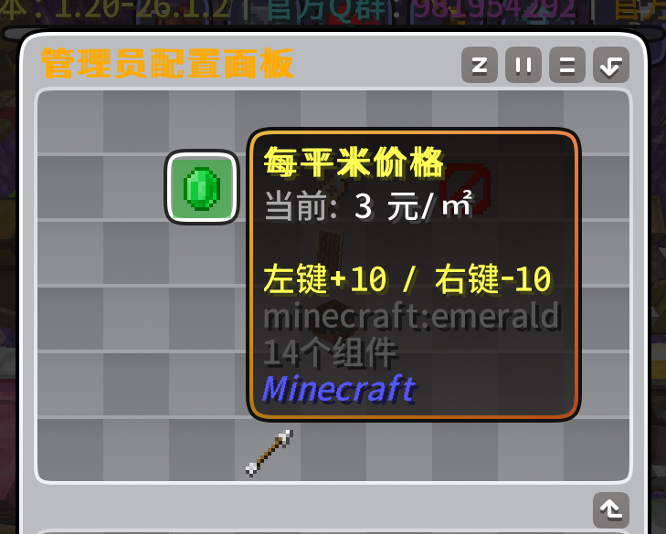 
- 管理面板-用户组: 给玩家开通VIP
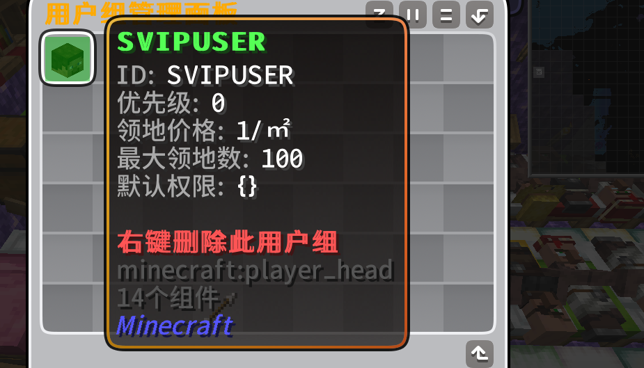

