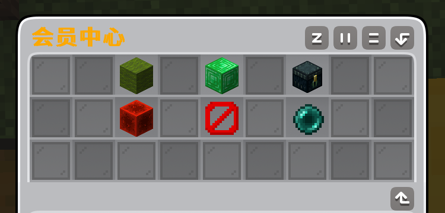
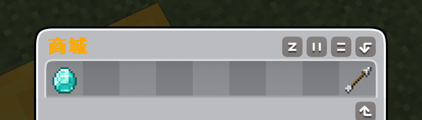
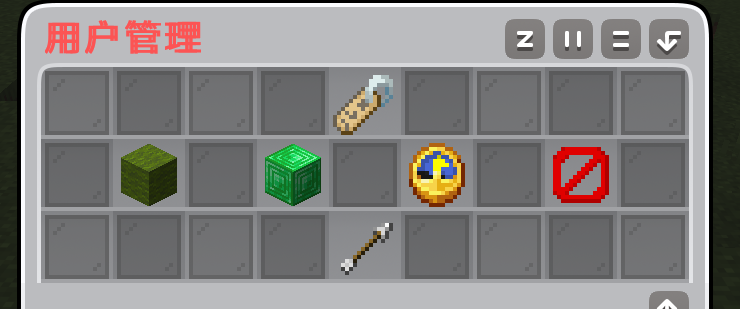

# 云背包使用指南
## 云背包介绍
 云背包插件，是由sdf1团队开发，为解决玩家物理存储空间有限、寻找物品困难而开发的。 
 它允许玩家将自己的物品，寄托于云背包中，玩家不需要在为自己基地被盗、基地空间不够而担心

 ## 安装必看
 1. [可选前置] **Vault** 经济插件
 2. [可选前置] sdf1 插件(开发中)
## 安装方法
 1. 下载云背包插件
 2. 将插件放入服务器件目录
 3. 重启服务器

## 可用参数
 - /cy  打开云背包首页
 - /cy reload  重载云背包配置文件
 - /cy add/set/remove ID/shopname 修改云背包商品库存
 - /cy update 检查更新

## 使用方法-玩家
 1. 玩家输入指令`/cy`，即可打开云背包首页 
 2. 首次使用时，玩家需购买云背包空间(此问题将在下个版本修复，下个版本将开放免费空间)
 3. 点击首页`商城`，选择自己想要的套餐规则，点击购买即可 
## 使用方法-管理员
1. 此版本管理员权限未作分隔，默认OP可用
2. 点击`管理员面板`，输入密码，随后输入玩家名，即可操作他的数据(如会员期限、格口数量) 
3. 默认密码`qweasd`，建议您及时修改，修改位置：`plugins/CY_beibao/商品.txt`
4. 修改后，`/cy reload`重载即可生效
5. 库存修改，使用指令`/cy add/set/remove ID/shopname 数量`即可修改。 值得注意的是，`id/shopname`是2选1条件，ID是商品唯一ID，shopname是商品名字，填入任意一个即可修改

## 下载地址
*详见GitHub或gitee的release页面*

## 插件源码
[**github**](https://github.com/ypsdf1/CY_beibao) 
[**gitee**](https://gitee.com/nihaoshidifu/cy_beibao)

## 版本更新
| 版号 | 内容 | 正式版/测试版 |
| --- | --- | --- |
| 1.0 |  第一个测试版 | 测试版 |
| 1.1 | 第二个测试版，允许翻页 | 测试版 |
| 1.3 | 第一个正式版，加入商城、管理原面板等功能 | 正式版 |

## 注意事项
- 本项目由Xiaomi Mimo大模型开发
- 环境适配：jdk21+paper1.21.11
- 本插件为免费插件，请勿商业转发
- 本插件为草原探险服务器定制插件，体验最新内测版，建议您游玩草原探险服务器或加入我们的[官方群981954292](http://qm.qq.com/cgi-bin/qm/qr?_wv=1027&k=ftGx3Ac2pd8IbWV5WZmoIrVHRXgGUb2a&authKey=DLTKLbiInzZe0pegvDtXbTVXeLJ6TAaPtHd3ol8p5adiljTSzzEp8hHU%2BLA4kBT4&noverify=0&group_code=981954292)获取。
