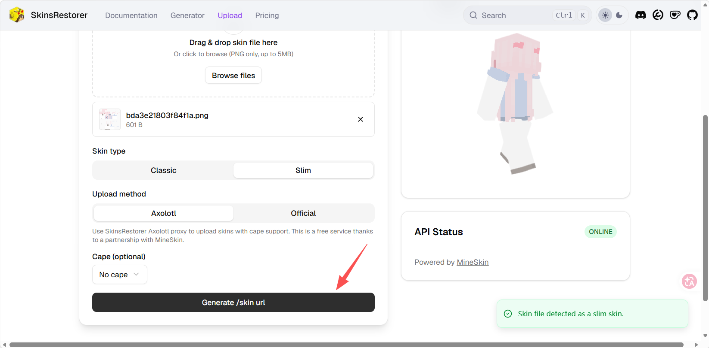
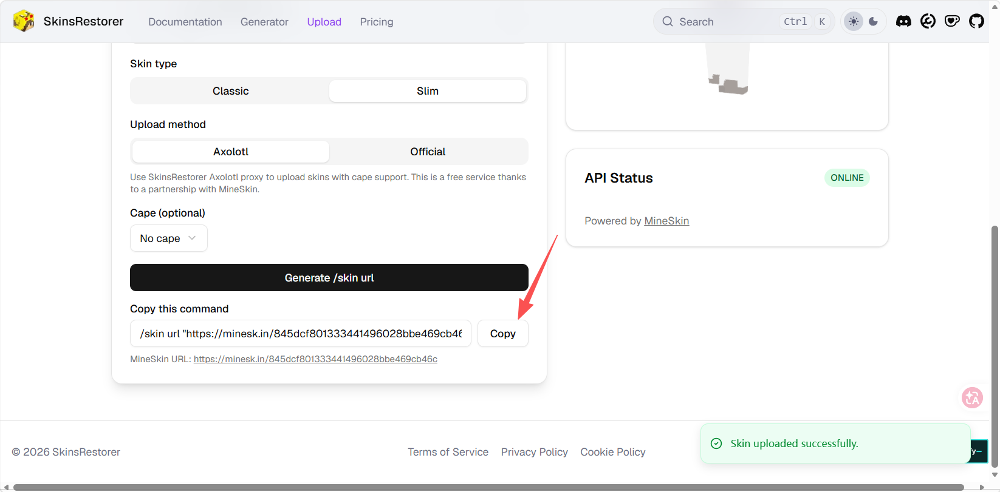
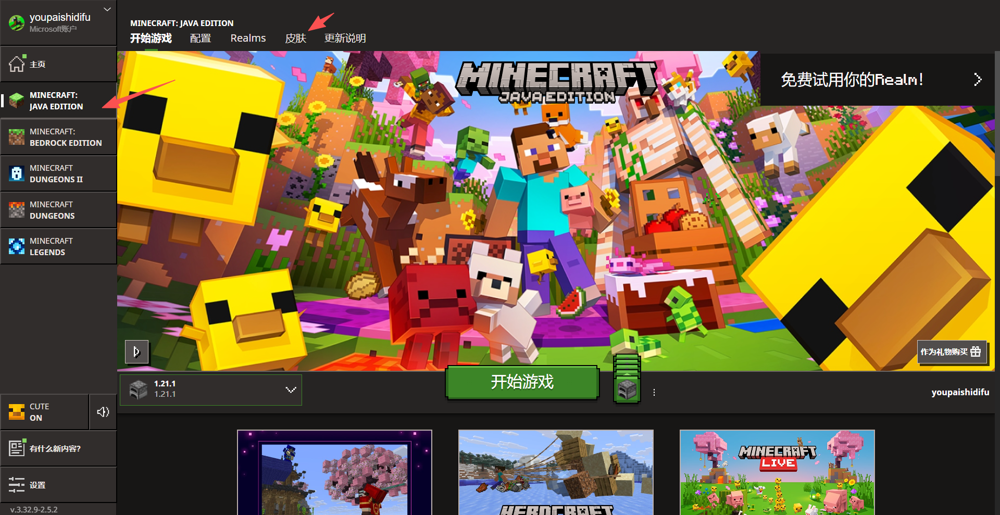
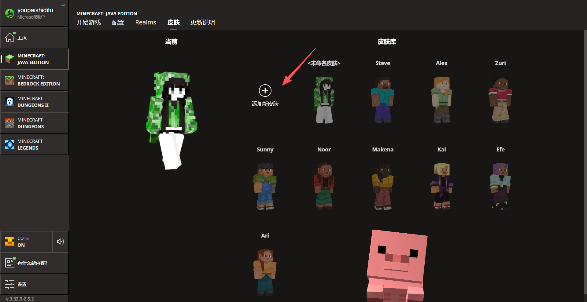
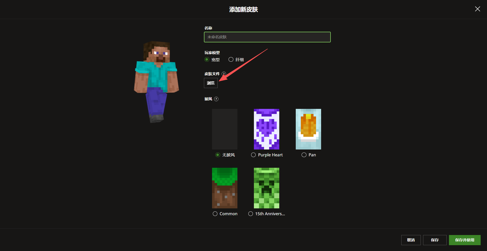
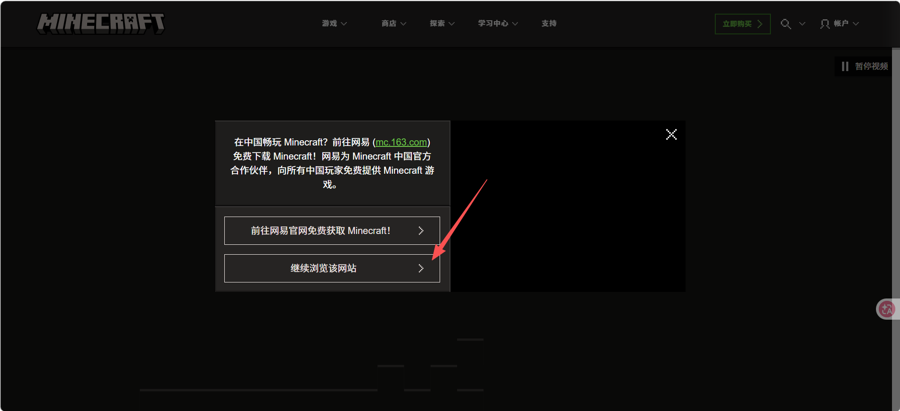
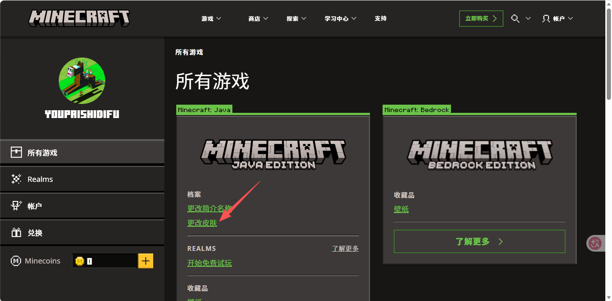

# 非正版&正版玩家更新皮肤指南
## 作者：youpaishidifu

## menu
1.下载皮肤文件

2.上传图床获取直连

3.使用指令设置为该链接的皮肤

4.设置为正版玩家皮肤

### 1.下载皮肤文件
您可在各类皮肤站、第三方登陆器下载您的皮肤，这里推荐[namemc](https://namemc.com/#
)

### 2. 上传图床获取直连
将下载的png文件，上传下放地址：
[https://skinsrestorer.net/upload](https://skinsrestorer.net/upload)

### 3. 使用指令设置为该链接的皮肤
上传完成后，点底下的generate /skin url，生成链接后，完整复制，在游戏内粘贴即可

### 4. 设置为正版玩家皮肤
使用指令`/skin set 玩家名`即可将链接设置为正版玩家皮肤

---
## 正版玩家更新皮肤指南

## menu
1.下载皮肤文件 
2.将皮肤文件通过官方启动器上传/官网上传 
3.使用指令更新皮肤

### 1.下载皮肤文件
您可在各类皮肤站、第三方登陆器下载您的皮肤，这里推荐[namemc](https://namemc.com/#
)

### 2. 将皮肤文件通过官方启动器/官网上传
打开Miecraft官方启动器，选择Java版

点击`皮肤`按钮，点击`+`按钮，将皮肤文件上传上去，并点击`保存`按钮

随后选择刚上传的皮肤，点击`使用`按钮

### 2.1 官网上传
打开[Miecraft官网](https://www.minecraft.net/zh-hans/msaprofile/mygames/editskin)，点击`登录`，点击`我的游戏`，选择`minecraft java`版，点击`账户`→`档案`→`所有游戏`→`更换皮肤`
需要注意的是，网易会尝试节流，遇到如下弹窗，点击`继续留在Minecraft.net`或`stay on minecraft.net`

### 3. 使用指令更新皮肤
上述所有步骤完成后，使用指令`/skin update`即可将皮肤应用到您的角色上

